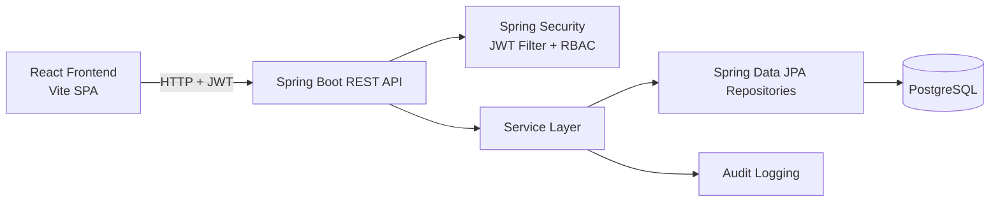

# Stockflow

> Spring Boot and React inventory management system with JWT authentication, role-based access control, warehouse-level stock tracking, dashboards, and audit logging.

## Project Overview

Stockflow is a full-stack inventory management application built with a Spring Boot REST API and a React single-page frontend. It supports authentication, role-based access, operational stock movement, dashboard reporting, audit visibility, and administration workflows for users and roles.

The backend exposes secured REST endpoints for inventory and master data management, while the frontend provides role-aware dashboards and pages for products, warehouses, inventory operations, suppliers, categories, audit logs, and user role control.

## Problem Statement

Inventory operations often break down when product data, stock movement, user permissions, and audit history are spread across disconnected tools. Stockflow addresses that problem by centralizing:

- user authentication and authorization
- warehouse-specific stock management
- inventory transaction tracking
- administrative control over roles and users
- operational visibility through dashboards and audit logs

## Features

- JWT-based login and signup flow
- Role-based access control for `ADMIN`, `MANAGER`, `STAFF`, and `VIEWER`
- Role-specific dashboard landing pages and dashboard cards
- Product management with search by product name or SKU
- Warehouse management
- Supplier management
- Category management
- Inventory stock-in operations
- Inventory stock-out operations
- Inventory transfers between warehouses
- Warehouse-level inventory source of truth via `WarehouseStock`
- Inventory transaction history with typed records: `STOCK_IN`, `STOCK_OUT`, `TRANSFER_IN`, and `TRANSFER_OUT`
- Inventory value calculation from product price and warehouse stock
- Audit logging for inventory operations with acting user, action, product, warehouse context, quantity, and timestamp
- Admin user listing
- Admin user lookup by email
- Admin user role updates
- Admin user deletion
- Seeded roles and sample users on startup
- Integration tests for core inventory flows

## Tech Stack

### Backend

- Java 21
- Spring Boot 3.5.16
- Spring Web
- Spring Data JPA
- Spring Security
- Jakarta Validation
- JJWT 0.12.6
- PostgreSQL

### Frontend

- React 19
- Vite 8
- React Router DOM 7
- Fetch API via a shared request utility
- CSS-based UI styling

### Testing

- JUnit 5
- Spring Boot Test
- Spring Security Test
- H2 in-memory database for backend tests

## System Architecture



### Backend Layers

- Controllers expose REST endpoints under `/api`
- Services contain authorization-aware business logic
- Repositories provide persistence through Spring Data JPA
- Security uses JWT tokens and route-level plus method-level authorization

### Frontend Flow

- Public routes: login and signup
- Protected routes: gated by token and role
- Shared app shell: navigation, role-specific landing, and authenticated layout
- Page components call the backend through a centralized request helper

## Database Design

The application uses JPA entities with Hibernate schema management (`spring.jpa.hibernate.ddl-auto=update`).

### Core Tables

| Table | Purpose | Key Columns |
| --- | --- | --- |
| `users` | Stores application users | `id`, `full_name`, `email`, `password`, `enabled`, `role_id` |
| `roles` | Stores role authorities | `id`, `name` |
| `products` | Stores product master data | `id`, `name`, `sku`, `price` |
| `warehouses` | Stores warehouse master data | `id`, `name`, `location` |
| `warehouse_stock` | Stores current stock per product per warehouse | `id`, `product_id`, `warehouse_id`, `quantity`, `version` |
| `inventory` | Stores inventory transaction history | `id`, `product_id`, `warehouse_id`, `quantity`, `type`, `remarks`, `created_at` |
| `suppliers` | Stores supplier master data | `id`, `name`, `contact_person`, `email`, `phone`, `address` |
| `categories` | Stores category master data | `id`, `name`, `description` |
| `audit_logs` | Stores audit trail records | `id`, `user_name`, `user_email`, `action`, `details`, `created_at` |

### Relationships

- `users.role_id -> roles.id`
- `warehouse_stock.product_id -> products.id`
- `warehouse_stock.warehouse_id -> warehouses.id`
- `inventory.product_id -> products.id`
- `inventory.warehouse_id -> warehouses.id`

### Inventory Model Notes

- Current stock is stored only in `warehouse_stock`
- Product-level total quantity is derived by summing warehouse stock
- Inventory history is append-only through the `inventory` table
- Inventory transaction type is stored as an enum string

## Roles & Permissions

### Roles

- `ADMIN`: full system control, including user and role management
- `MANAGER`: operational management without admin-only actions
- `STAFF`: inventory execution and limited operational visibility
- `VIEWER`: read-oriented access

### Access Matrix

| Area | ADMIN | MANAGER | STAFF | VIEWER |
| --- | --- | --- | --- | --- |
| Dashboard | Yes | Yes | Yes | Yes |
| View products | Yes | Yes | Yes | Yes |
| Create/update products | Yes | Yes | No | No |
| Delete products | Yes | No | No | No |
| View warehouses | Yes | Yes | Yes | No |
| Create/update warehouses | Yes | Yes | No | No |
| Delete warehouses | Yes | No | No | No |
| View inventory transactions | Yes | Yes | Yes | Yes |
| Stock in / stock out / transfer | Yes | Yes | Yes | No |
| View suppliers | Yes | Yes | No | No |
| Create/update suppliers | Yes | Yes | No | No |
| Delete suppliers | Yes | No | No | No |
| View categories | Yes | Yes | No | No |
| Create/update categories | Yes | Yes | No | No |
| Delete categories | Yes | No | No | No |
| View audit logs | Yes | Yes | No | No |
| View users | Yes | No | No | No |
| Update user roles | Yes | No | No | No |
| Delete users | Yes | No | No | No |

## API Overview

Base URL: `http://localhost:8080/api`

### Authentication

| Method | Endpoint | Description |
| --- | --- | --- |
| `POST` | `/auth/login` | Authenticate a user and return a JWT |
| `POST` | `/auth/signup` | Register a new user with the default viewer role |

### Dashboard

| Method | Endpoint | Description |
| --- | --- | --- |
| `GET` | `/dashboard` | Role-aware dashboard statistics and recent transactions |

### Products

| Method | Endpoint | Description |
| --- | --- | --- |
| `GET` | `/products` | List products with derived total quantity |
| `GET` | `/products/{id}` | Get a single product |
| `GET` | `/products/search?query=...` | Search by name or SKU |
| `POST` | `/products` | Create a product |
| `PUT` | `/products/{id}` | Update a product |
| `DELETE` | `/products/{id}` | Delete a product |

### Warehouses

| Method | Endpoint | Description |
| --- | --- | --- |
| `GET` | `/warehouses` | List warehouses |
| `GET` | `/warehouses/{id}` | Get a warehouse |
| `POST` | `/warehouses` | Create a warehouse |
| `PUT` | `/warehouses/{id}` | Update a warehouse |
| `DELETE` | `/warehouses/{id}` | Delete a warehouse |

### Inventory

| Method | Endpoint | Description |
| --- | --- | --- |
| `GET` | `/inventory` | List inventory transactions |
| `POST` | `/inventory/stock-in` | Increase stock in a warehouse |
| `POST` | `/inventory/stock-out` | Decrease stock in a warehouse |
| `POST` | `/inventory/transfer` | Transfer stock between warehouses |

### Suppliers

| Method | Endpoint | Description |
| --- | --- | --- |
| `GET` | `/suppliers` | List suppliers |
| `GET` | `/suppliers/{id}` | Get a supplier |
| `POST` | `/suppliers` | Create a supplier |
| `PUT` | `/suppliers/{id}` | Update a supplier |
| `DELETE` | `/suppliers/{id}` | Delete a supplier |

### Categories

| Method | Endpoint | Description |
| --- | --- | --- |
| `GET` | `/categories` | List categories |
| `GET` | `/categories/{id}` | Get a category |
| `POST` | `/categories` | Create a category |
| `PUT` | `/categories/{id}` | Update a category |
| `DELETE` | `/categories/{id}` | Delete a category |

### Audit Logs

| Method | Endpoint | Description |
| --- | --- | --- |
| `GET` | `/audit-logs` | List audit log entries ordered by newest first |

### Users

| Method | Endpoint | Description |
| --- | --- | --- |
| `GET` | `/users` | List all users |
| `GET` | `/users/email/{email}` | Look up a user by email |
| `PUT` | `/users/{id}/role` | Update a user role |
| `DELETE` | `/users/{id}` | Delete a user |

## Installation

### Backend Setup

Prerequisites:

- Java 21+
- PostgreSQL

Environment:

The backend reads configuration from `backend/src/main/resources/application.properties` with these defaults:

- `SPRING_DATASOURCE_URL=jdbc:postgresql://localhost:5432/inventory`
- `SPRING_DATASOURCE_USERNAME=postgres`
- `SPRING_DATASOURCE_PASSWORD=12345`
- `JWT_SECRET=stockflow-change-me-secret-key-32`
- `JWT_EXPIRATION_MS=86400000`
- `CORS_ALLOWED_ORIGINS=http://localhost:5173`

Run backend:

```bash
cd backend
./mvnw spring-boot:run
```

On Windows:

```powershell
cd backend
.\mvnw.cmd spring-boot:run
```

The backend starts on `http://localhost:8080`.

### Frontend Setup

Prerequisites:

- Node.js
- npm

Run frontend:

```bash
cd frontend/stockflow
npm install
npm run dev
```

The frontend starts on `http://localhost:5173`.

Production build:

```bash
cd frontend/stockflow
npm run build
```

## Project Structure

```text
Inventory/
|-- backend/
|   |-- pom.xml
|   `-- src/
|       |-- main/java/com/stockflow/
|       |   |-- audit/
|       |   |-- auth/
|       |   |-- category/
|       |   |-- config/
|       |   |-- dashboard/
|       |   |-- exception/
|       |   |-- inventory/
|       |   |-- product/
|       |   |-- role/
|       |   |-- security/
|       |   |-- supplier/
|       |   |-- user/
|       |   `-- warehouse/
|       |-- main/resources/
|       `-- test/
|-- frontend/
|   `-- stockflow/
|       |-- public/
|       `-- src/
|           |-- auth/
|           |-- components/
|           |-- config/
|           |-- pages/
|           |-- routes/
|           |-- services/
|           `-- styles/
|-- scenarios/
`-- README.md
```

## Sample Credentials

The application seeds sample users on startup:

| Role | Email | Password |
| --- | --- | --- |
| Admin | `admin@stockflow.com` | `Admin@123` |
| Manager | `manager@stockflow.com` | `Manager@123` |
| Staff | `staff@stockflow.com` | `Staff@123` |
| Viewer | `viewer@stockflow.com` | `Viewer@123` |

## Testing

### Backend Tests

Run:

```bash
cd backend
./mvnw test
```

The backend test suite includes integration coverage for:

- stock in success
- stock out success
- insufficient stock rejection
- transfer between warehouses
- same-warehouse rejection
- missing product or warehouse handling
- transaction rollback preserving data integrity

### Frontend Checks

Available frontend scripts:

```bash
cd frontend/stockflow
npm run build
npm run lint
```

## Future Enhancements

- Add API documentation with Swagger or OpenAPI
- Add pagination and filtering for large datasets
- Add warehouse stock visibility screens per product and warehouse
- Introduce database migration tooling
- Add export/reporting capabilities for inventory and audit history
- Add containerized deployment configuration

## Screenshots

Replace the placeholders below with actual screenshots from your deployment or local environment.

### Login


### Dashboard


### Products


### Inventory


### Audit Logs


